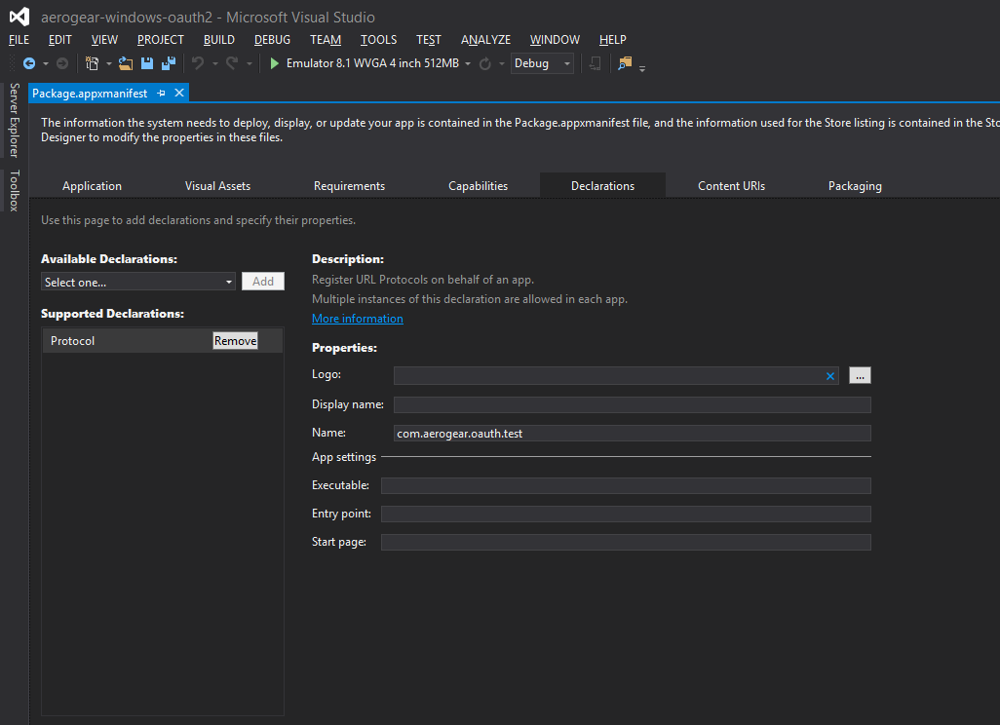

aerogear-windows-oauth2
=======================

OAuth2 Client for windows phone. Taking care of:

* account manager for multiple OAuth2 accounts
* request access and refresh token
* grant access through secure external browser and URI schema to re-enter app
* (implicit or explicit) refresh tokens
* permanent secure storage

Example Usage
-------------

In the example below is usage for google, first go to [google console](https://console.developers.google.com) create a project  select `API & auth` > `APIs` and enable `Drive API` then under `API & auth` > `Credentials` select `Create new client ID`
there select `Installed application` and then `iOS` (yeah you read that correctly select iOS) this is because iOS also supports setting up a special protocol so that you app
continues after being susspended. For bundle id choose any protocol you want.

Go to Visual Studio and open `Package.appxmanifest` go to `Declarations` add a protocol and set the bundle id you picked on the google console.



Next step is setting up the account in code, replace the `<google-client-id>` with your google client id:

```csharp

var config = await GoogleConfig.Create(													//[1]
    "<google-client-id>",
    new List<string>(new string[] { "https://www.googleapis.com/auth/drive" }),
    "google"
);

var module = await AccountManager.AddAccount(config);									//[2]
if (await module.RequestAccessAndContinue())											//[3]
{
    Upload(module);
}

```

First we create a google config [1] and add it to the AccounManager [2] then we RequestAccessAndContinue if the result is true the app will not be susspended and we can 
for instance upload to google drive, like in this example. If the result is false the app will be susspended and an Authentication dialog will appear.
To handle the continuation event you'll have to have the [contiuation manager](http://msdn.microsoft.com/en-us/library/dn631755.aspx) in you app.

Or implement it yourself:

```csharp
protected async override void OnActivated(IActivatedEventArgs args)
{
    if (args.Kind == ActivationKind.WebAuthenticationBrokerContinuation)
    {
		//get a reference to the page as IWebAuthenticationContinuable
		var wabPage = rootFrame.Content as IWebAuthenticationContinuable;
		wabPage.ContinueWebAuthentication(args as WebAuthenticationBrokerContinuationEventArgs);
    }
...
```

The page will have to implement the `IWebAuthenticationContinuable` interface like this:

```csharp
async void IWebAuthenticationContinuable.ContinueWebAuthentication(WebAuthenticationBrokerContinuationEventArgs args)
{
    Upload(await AccountManager.ParseContinuationEvent(args));
}
```

This will parse the ContinuationEvent and save the token from the oauth provider ( in this case google ) securly to the device. So next time the user will not need
to authenticate again. Upload to google drive passing the OAuthModule with the authentication headers needed

In you upload method you can use the `AuthzWebRequest` a special `WebRequest` that will take care of adding the authentication headers.
 
```csharp
public async void Upload(OAuth2Module module)
{
	var request = AuthzWebRequest.Create("https://www.googleapis.com/upload/drive/v2/files", module);
	request.Method = "POST";

	using (var postStream = await Task<Stream>.Factory.FromAsync(request.BeginGetRequestStream, request.EndGetRequestStream, request))
...
```